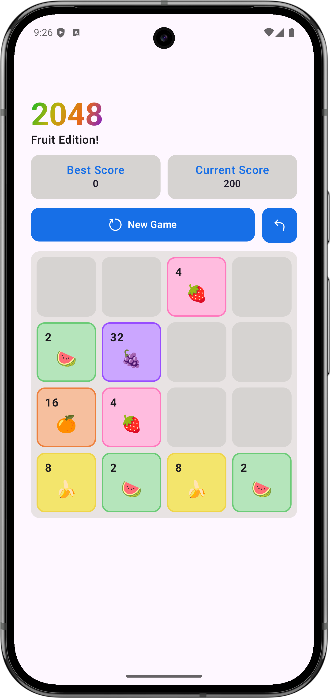
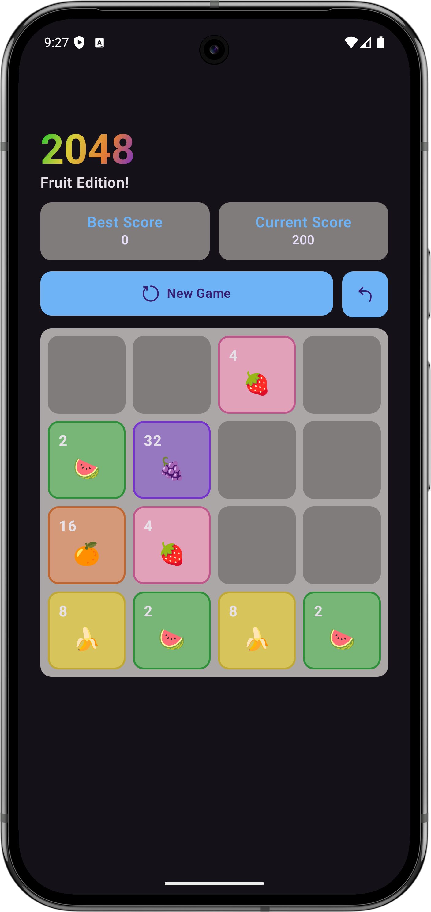

# 🍉 2048 – Fruit Edition
#### A fun and colorful 2048 puzzle game with a fruit theme, built using Jetpack Compose. Merge matching fruits to reach the highest score and unlock new fruit tiles! 🍓🍍

## ✨ Features
- 🍎 Classic 2048 gameplay with a fruit twist
- 🎨 Modern UI built entirely with Jetpack Compose
- 🌗 Light & Dark theme support
- 🔄 Undo move support
- 🏆 Best score saved locally
- 📱 Smooth animations

## 🎮 How to Play
1. Swipe in any direction (⬆️⬇️⬅️➡️)
2. Merge two identical fruits to create a bigger fruit
3. Each merge increases your score
4. The game ends when no more moves are possible

## 🧠 Architecture
#### The app follows MVVM:
- UI → Compose
- State → ViewModel + StateFlow
- Data → Room & DataStore
- Business logic → Repository layer

## 📸 Screenshots
| Light Mode                                     | Dark Mode                                     |
|------------------------------------------------|-----------------------------------------------|
|  |  |

## 📄 License
#### This project is licensed under the MIT License.

## 🙏 Credit
#### Tile UI design credit to the original designer from Figma.

